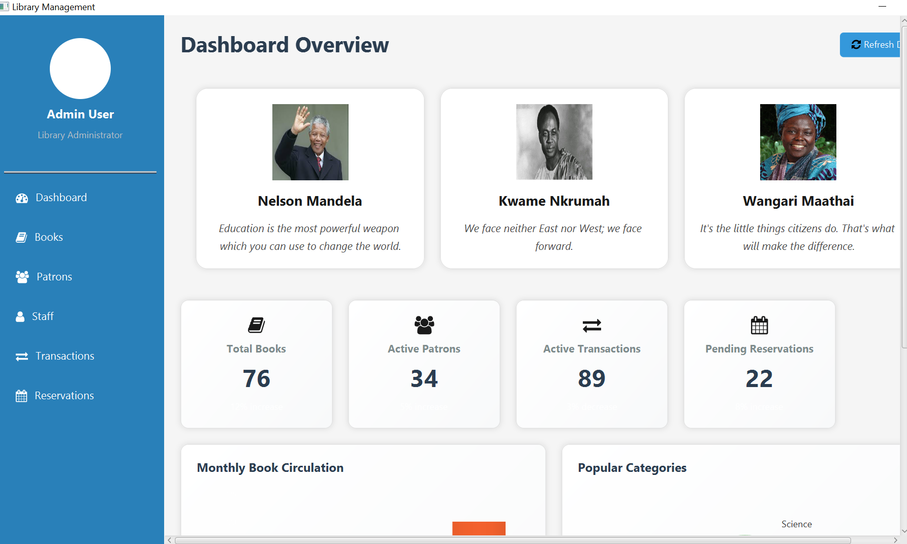
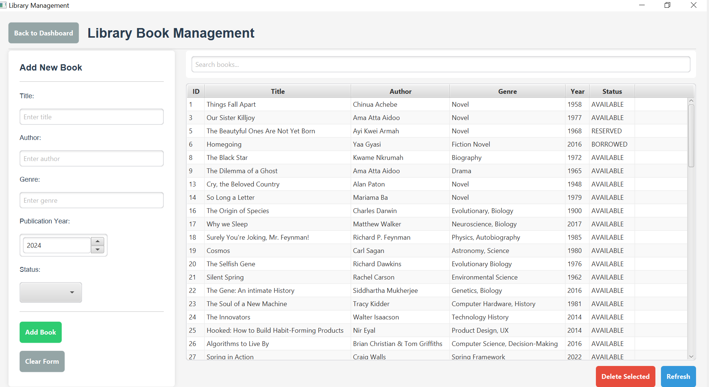
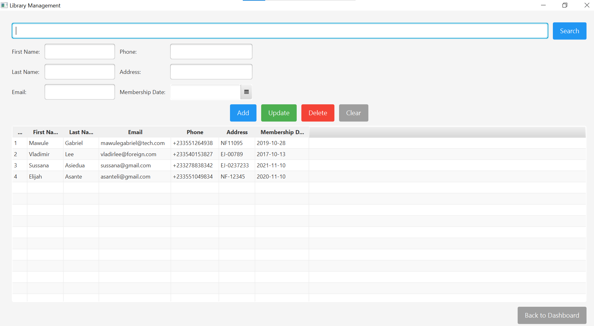
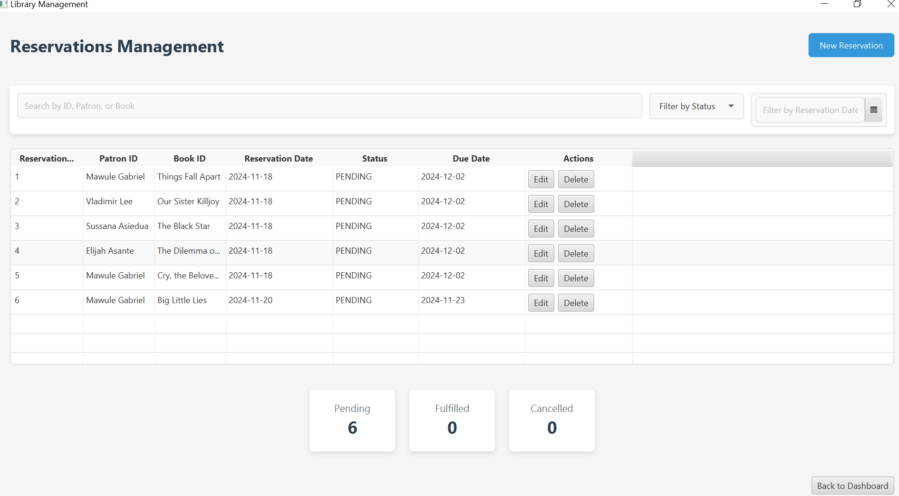
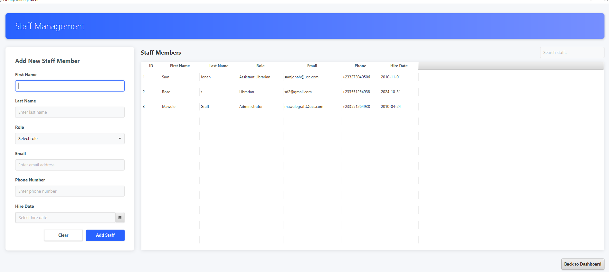
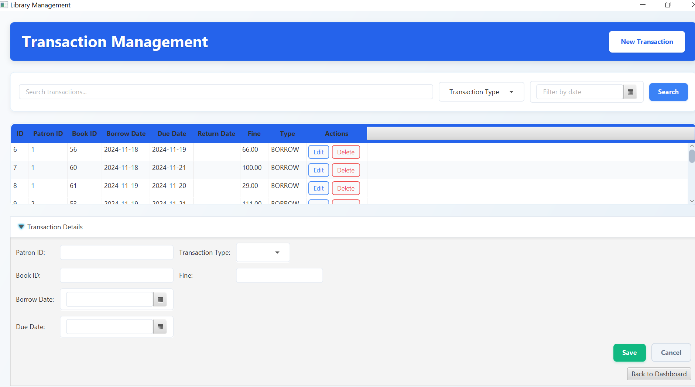

# Advanced Library Management System

# Library Management System built with <a href="https://openjfx.io/" target="_blank">JavaFX</a> and <a href="https://www.java.com/en/" target="_blank"> JAVA

## Overview
The Library Management System is an application designed to efficiently manage various aspects of library operations. It includes features for book and patron management, allowing librarians to track and organize library materials and user accounts. The system also supports transaction tracking, enabling easy monitoring of book checkouts, returns, and fines. Additionally, it offers a reservation system, where patrons can reserve books in advance, and a robust search functionality to help users quickly find books or other resources within the library’s collection.


## Major Features 🔑
### Dashboard View
The Dashboard View serves as the homepage of the Library Management System, providing an intuitive interface for library staff to navigate seamlessly to all essential sections. From this central hub, staff can access the Reservation section to manage book bookings, the Patron section to oversee user accounts and activities, and the Staff Management area to handle staff-related tasks. Additionally, the system offers easy access to the Transaction section for tracking book checkouts, returns, and fines, as well as the Books section for managing library inventory. This streamlined design ensures that library staff can efficiently perform all necessary operations in one convenient location.



### Book View
The Book View section allows library staff to easily add new books to the system by specifying essential details such as the title, author, genre, publication year, and status. This section also provides a comprehensive list of all books entered into the system, enabling staff to view and manage the library's collection. Additionally, staff can delete books that are no longer needed or have been removed from circulation, ensuring that the inventory remains accurate and up to date.



### Patron View
The Patron View section allows library staff to efficiently manage user records within the system. Staff can enter new patrons by specifying essential details such as their name, address, email, and membership date. Additionally, this section provides the ability to update patron information as needed, ensuring that records remain accurate and up to date. Staff can also delete patron records when necessary and utilize the search functionality to quickly find specific patrons within the system.



### Reservation View
The Reservation View allows staff to reserve resources for patrons. Staff are made to enter the patron's ID, select the book to be reserved, and set a due date for the reservation. This ensures that patrons can access the resources they need later.



### Staff Management View
The Staff Management View allows for the registration of library staff details, including their name, role, email, phone number, and hire date. Additionally, staff records can be searched for easy access and management of staff information within the system.



### Transaction View
The Transaction View enables staff to process transactions for patrons, such as borrowing or returning books. Staff can also specify fines for late returns, ensuring that all transactions are accurately recorded and managed.



## Technical Stack
- Java
- JavaFX
- MySQL/PostgreSQL
- JDBC


## Prerequisites
- JDK 17 or higher
- MySQL/PostgreSQL 
- Maven
- IDE (IntelliJ IDEA recommended)

  

## Installation
1. Clone the repository
```bash
git clone https://github.com/mawule-gabriel/mawule-gabriel-Library-Management-Sys.git


